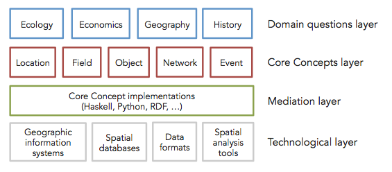

Core Concepts of Spatial Information
=============================================

*Abstract:* This repository contains the specifications and resources towards a language for spatial computing.
The goal of this work is to provide a high-level language for spatial computing that is executable 
on existing commercial and open source spatial computing platforms, 
particularly Geographic Information Systems (GIS). 
The key idea of the approach is to target an abstraction level higher 
than that of GIS commands and data formats, yet meaningful within and across
application domains. The paper describes the underlying theory of spatial 
information and shows its evolving formal specification. An embedding in Python
exemplifies access to commonly available implementations of spatial computations.
For details, see references (Kuhn 2012; Kuhn & Ballatore 2015).

*Keywords:* spatial computing; domain-specific languages; geographic information science 

Members & contributors:

* Prof. **Werner Kuhn**   ([home](http://geog.ucsb.edu/~kuhn))
* Dr. **Andrea Ballatore**   ([home](http://sites.google.com/site/andreaballatore))
* Eric Ahlgren
* Marc Thiemann
* Michel Zimmer  ([home](https://www.mzimmer.net))

Architecture
----------------------

Contents
----------------------

`CoreConceptsHs`: The Haskell specifications of the core concepts.

`CoreConceptsPy`: A Python implementation of the core concepts.

`CoreConceptsRdf`: An RDF(S) implementation of the core concepts.

Misc 
----------------------

[Notes for contributors](CONTRIBUTING.md)

References
----------------------

Kuhn, W. & Ballatore, A. (2015). *Designing a Language for Spatial Computing.* AGILE 2015, Lisbon, Portugal [in press] 

Kuhn, W. (2012). *Core concepts of spatial information for transdisciplinary research.* International Journal of Geographical Information Science, 26(12), 2267-2276. <[PDF](http://ifgi.uni-muenster.de/~kuhn/research/publications/pdfs/refereed%20journals/IJGIS%202012.pdf)>
